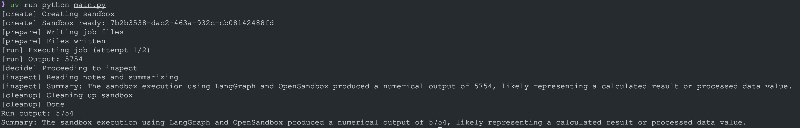

# LangGraph Agent + OpenSandbox Example

Integrate LangGraph with OpenSandbox using a graph-driven control flow. The example uses
explicit state machine nodes to create, prepare, run, inspect, and clean up a sandbox, plus
a decision node to retry with a fallback command if the run step fails.

## Start OpenSandbox server [local]

Pre-pull the code-interpreter image (includes Python):

```shell
docker pull sandbox-registry.cn-zhangjiakou.cr.aliyuncs.com/opensandbox/code-interpreter:latest

# use docker hub
# docker pull opensandbox/code-interpreter:latest
```

Start the local OpenSandbox server, logs will be visible in the terminal:

```shell
git clone git@github.com:alibaba/OpenSandbox.git
cd OpenSandbox/server
cp example.config.toml ~/.sandbox.toml
uv sync
uv run python -m src.main
```

## Run the example

```shell
# Install OpenSandbox + LangGraph deps
uv pip install opensandbox langgraph langchain-anthropic

# Run the example (requires SANDBOX_DOMAIN / SANDBOX_API_KEY / ANTHROPIC_API_KEY)
uv run python examples/langgraph/main.py
```

The workflow writes files, executes a job, retries with a fallback command on failure (default
`python` vs `python3`), then summarizes results with Claude and cleans up the sandbox instance.



## Environment Variables

- `SANDBOX_DOMAIN`: Sandbox service address (default: `localhost:8080`)
- `SANDBOX_API_KEY`: API key if your server requires authentication (optional for local)
- `SANDBOX_IMAGE`: Sandbox image to use (default: `sandbox-registry.cn-zhangjiakou.cr.aliyuncs.com/opensandbox/code-interpreter:latest`)
- `ANTHROPIC_API_KEY`: Your Anthropic API key (required if `ANTHROPIC_AUTH_TOKEN` is unset)
- `ANTHROPIC_AUTH_TOKEN`: Alternate Anthropic auth token (uses `Authorization` header)
- `ANTHROPIC_API_KEY` and `ANTHROPIC_AUTH_TOKEN` should not be set together
- `ANTHROPIC_BASE_URL`: Anthropic API endpoint override (optional)
- `ANTHROPIC_MODEL`: Model to use (default: `claude-3-5-sonnet-latest`)

## References
- [LangGraph](https://langchain-ai.github.io/langgraph/) - Agent workflow framework
